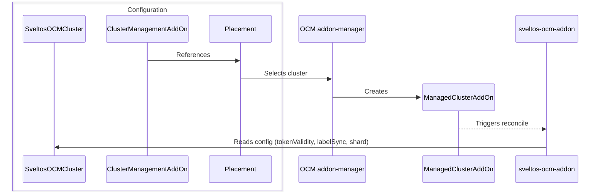
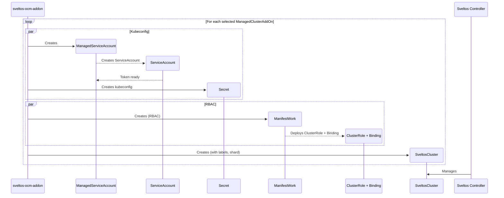
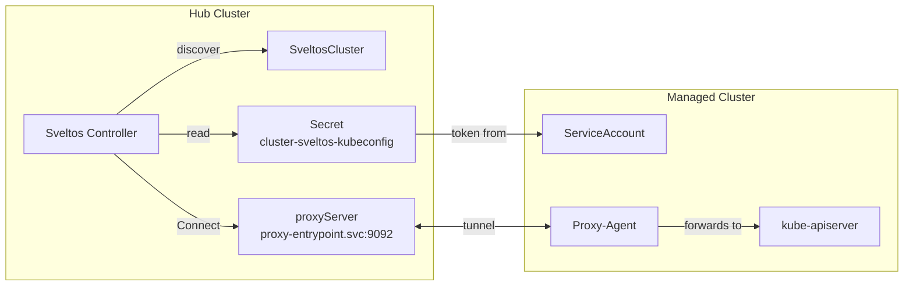

# Sveltos OCM Addon

An [Open Cluster Management](https://open-cluster-management.io/) addon that automatically registers OCM managed clusters as [Sveltos](https://projectsveltos.github.io/sveltos/) clusters.

## Why?

**OCM** excels at cluster registration and lifecycle management, while **Sveltos** provides powerful Kubernetes add-on deployment with features like templating, drift detection, and dry-run. This addon bridges both systems, letting you:

- Use OCM's cluster discovery and Placement API for cluster selection
- Deploy workloads via Sveltos ClusterProfiles/Profiles
- Sync labels from ManagedCluster to SveltosCluster for consistent targeting

## How it works

1. A `ManagedClusterAddOn` called "sveltos-ocm-addon" is created on selected clusters (manually or via Placement)
2. The controller creates a `ManagedServiceAccount` to obtain a token for each cluster
3. A kubeconfig secret is created on the hub. It uses `cluster-proxy` to reach the managed cluster.
4. RBAC for sveltos is deployed on managed clusters via `ManifestWork`
5. A `SveltosCluster` resource is created on the hub.  
   Based on the `SveltosOCMCluster` configuration:
   1. Labels from the OCM `ManagedCluster` are copied to the `SveltosCluster`
   2. The shard label is added to the `SveltosCluster`
6. The Sveltos controller picks up the `SveltosCluster` and starts managing it.

## Prerequisites

- OCM Hub (v0.15.0+)
- [cluster-proxy](https://open-cluster-management.io/docs/concepts/addon/#cluster-proxy) with `enableServiceProxy=true`
- [managed-serviceaccount](https://open-cluster-management.io/getting-started/integration/managed-serviceaccount/) addon (v0.7.0+)
- Sveltos CRDs on the hub

```bash
kubectl apply -f https://raw.githubusercontent.com/projectsveltos/libsveltos/main/config/crd/bases/lib.projectsveltos.io_sveltosclusters.yaml
```

## Installation

```bash
# CRDs
make install

# Controller
export IMG=<your-registry>/sveltos-ocm-addon:latest
make docker-build docker-push deploy IMG=${IMG}

# OCM resources (Placement, ClusterManagementAddOn, SveltosOCMCluster)
kubectl apply -k config/ocm
```

## Configuration

```yaml
apiVersion: sveltos.open-cluster-management.io/v1alpha1
kind: SveltosOCMCluster
metadata:
  name: default
  namespace: open-cluster-management
spec:
  tokenValidity: "168h"  # Token validity (default: 7 days)
  labelSync: true        # Sync labels ManagedCluster -> SveltosCluster
  shard: ""              # Sveltos shard (optional)
```

## Cluster Selection

To filter clusters, create a `Placement` and reference it in the `ClusterManagementAddOn`:

```yaml
# 1. Namespace + ManagedClusterSetBinding
apiVersion: v1
kind: Namespace
metadata:
  name: sveltos-ocm-addon
---
apiVersion: cluster.open-cluster-management.io/v1beta2
kind: ManagedClusterSetBinding
metadata:
  name: default
  namespace: sveltos-ocm-addon
spec:
  clusterSet: default
---
# 2. Placement
apiVersion: cluster.open-cluster-management.io/v1beta1
kind: Placement
metadata:
  name: sveltos-enabled-clusters
  namespace: sveltos-ocm-addon
spec:
  predicates:
    - requiredClusterSelector:
        labelSelector:
          matchLabels:
            sveltos-enabled: "true"
---
# 3. ClusterManagementAddOn referencing the Placement
apiVersion: addon.open-cluster-management.io/v1alpha1
kind: ClusterManagementAddOn
metadata:
  name: sveltos-ocm-addon
  annotations:
    addon.open-cluster-management.io/lifecycle: "addon-manager"
spec:
  addOnMeta:
    displayName: Sveltos OCM Integration
    description: Registers OCM managed clusters with Sveltos
  supportedConfigs:
    - group: sveltos.open-cluster-management.io
      resource: sveltosocmclusters
  installStrategy:
    type: Placements
    placements:
      - name: sveltos-enabled-clusters        # References the Placement above
        namespace: sveltos-ocm-addon
        configs:
          - group: sveltos.open-cluster-management.io
            resource: sveltosocmclusters
            name: default
            namespace: open-cluster-management
```

Then label clusters: `kubectl label managedcluster <name> sveltos-enabled=true`

## Monitoring

```bash
# Global status
kubectl get sveltosocmcluster default -n open-cluster-management -o yaml

# Created SveltosClusters
kubectl get sveltosclusters -A

# Logs
kubectl logs -n sveltos-ocm-addon-system deploy/sveltos-ocm-addon-controller-manager
```

## Troubleshooting

| Issue                | Check                                                             |
| -------------------- | ----------------------------------------------------------------- |
| Addon not installed  | `kubectl get managedclusteraddon sveltos-ocm-addon -n <cluster>`  |
| Token not ready      | `kubectl get managedserviceaccount sveltos-ocm -n <cluster>`      |
| Cluster not selected | `kubectl get placementdecisions -n open-cluster-management-addon` |

## Uninstall

```bash
kubectl delete -k config/ocm
make undeploy uninstall
```

---

## Architecture

### Reconciliation Flow






### Network Flow

How Sveltos reaches managed clusters through cluster-proxy:



## References

- [Open Cluster Management](https://open-cluster-management.io/)
- [Sveltos](https://projectsveltos.github.io/sveltos/)
- [cluster-proxy](https://open-cluster-management.io/docs/concepts/addon/#cluster-proxy)
- [managed-serviceaccount](https://github.com/open-cluster-management-io/managed-serviceaccount)

## License

Apache License 2.0
